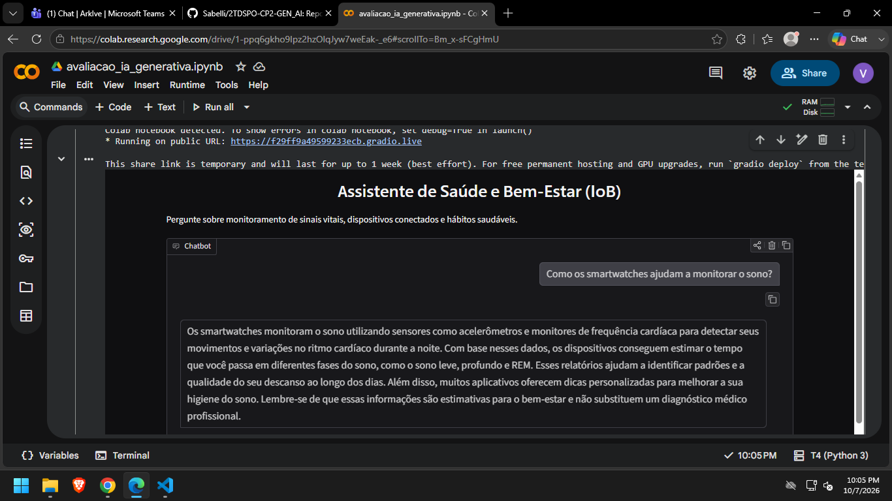

# Avaliação: Assistente de IA Generativa com Hugging Face e Gemini

**Disciplina:** Disruptive Architectures: IoT, IoB & Generative AI  
**Curso:** Análise e Desenvolvimento de Sistemas  
**Base:** Atividade "Assistente de IA Generativa com Hugging Face e Gemini"

---

## Sumário

1. [Objetivo](#1-objetivo)
2. [O que o grupo vai construir](#2-o-que-o-grupo-vai-construir)
3. [Temas](#3-temas)
4. [Pré-requisitos](#4-pré-requisitos)
5. [Configuração passo a passo](#5-configuração-passo-a-passo)
6. [As etapas da avaliação](#6-as-etapas-da-avaliação)
7. [Entrega](#7-entrega)
8. [Erros comuns](#8-erros-comuns)
9. [Segurança dos tokens](#9-segurança-dos-tokens)
10. [Estrutura deste repositório](#10-estrutura-deste-repositório)
11. [Referências](#11-referências)

---

## 1. Objetivo

Aprofundar o assistente construído na atividade anterior, explorando recursos que vão além da personalidade básica:

- **Guardrails** via `system` prompt
- **Controle de temperatura** na geração de texto
- **Troca de modelo** durante o chat com histórico compartilhado
- **Interface web** com Gradio incluindo slider de temperatura
- **(Bônus)** API REST com sessões independentes

Os modelos são os mesmos da atividade:

- **Hugging Face Inference API** — `meta-llama/Llama-3.1-8B-Instruct`
- **Google Gemini API** — `gemini-3.5-flash-lite`

---

## 2. O que o grupo vai construir

```
Etapa 1  Assistente com guardrails       (restrições no system)
   |
Etapa 2  Comparação com temperatura      (temperature=0.0 vs 1.0, dois modelos)
   |
Etapa 3  Chat com memória e troca        (histórico compartilhado entre HF e Gemini)
   |
Etapa 4  Interface web com Gradio        (seletor de modelo + slider de temperatura)
   |
Etapa 5  (Bônus) API com sessões         (histórico por session_id)
```

Tudo é feito no notebook `avaliacao_ia_generativa.ipynb`, que já vem com o código funcionando. O trabalho do grupo é **adaptar o código ao seu tema**, executar, testar e registrar as observações pedidas em cada etapa.

---

## 3. Temas

O grupo usa o **mesmo tema** escolhido na atividade anterior.

| # | Tema | Sobre o que o assistente fala |
|---|------|-------------------------------|
| 1 | Assistente de casa inteligente | Automação residencial, sensores e dispositivos conectados |
| 2 | Suporte técnico de IoT | Diagnóstico de problemas comuns com ESP32, Arduino, Wi-Fi e sensores |
| 3 | Tutor de protocolos IoT | MQTT, HTTP, CoAP e LoRa explicados para iniciantes, com exemplos simples |
| 4 | Assistente de saúde e bem-estar (IoB) | Interpretação de dados de wearables (passos, sono, frequência cardíaca), **sem dar diagnóstico médico** |
| 5 | Consultor de agricultura inteligente | Irrigação, umidade do solo e estações meteorológicas conectadas |
| 6 | Assistente de mobilidade urbana | Cidades inteligentes, transporte, estacionamento e semáforos conectados |
| 7 | Consultor de eficiência energética | Dicas de consumo com base em medidores inteligentes e tomadas conectadas |
| 8 | Guia de privacidade e ética em IoB | Riscos da coleta de dados comportamentais, LGPD e consentimento do usuário |

---

## 4. Pré-requisitos

- Conta Google (para o **Google Colab** e a chave do **Gemini**)
- Conta no **Hugging Face** (gratuita): https://huggingface.co/join
- Conta no **GitHub** (para a entrega)

Não é preciso instalar nada no computador. Tudo roda no Colab.

---

## 5. Configuração passo a passo

### 5.1 Tokens

As instruções de geração de token do Hugging Face e do Gemini são as mesmas da atividade anterior. Consulte o README da atividade se precisar.

### 5.2 Abrir o notebook no Colab

**Opção A:** no Colab, vá em **Arquivo > Abrir notebook > GitHub**, cole o link deste repositório e selecione `avaliacao_ia_generativa.ipynb`.

**Opção B:** baixe o arquivo `.ipynb` e, no Colab, vá em **Arquivo > Fazer upload de notebook**.

Depois, salve uma cópia no seu Drive: **Arquivo > Salvar uma cópia no Drive**.

### 5.3 Cadastrar os tokens nos Secrets do Colab

1. No Colab, clique no **ícone de chave** na barra lateral esquerda
2. Clique em **Adicionar novo secret**
3. Crie dois secrets com estes nomes **exatos**:

| Nome | Valor |
|------|-------|
| `HF_TOKEN` | token do Hugging Face |
| `GEMINI_API_KEY` | chave do Gemini |

4. Ative a opção **Acesso ao notebook** nos dois

### 5.4 Testar a configuração

Execute as células da seção **0. Configuração**. A saída esperada é:

```
HF_TOKEN ok
GEMINI_API_KEY ok
```

---

## 6. As etapas da avaliação

Em todas as etapas, altere os trechos marcados com `# >>> PERSONALIZE` e responda as **Observações do grupo** nas células de texto.

### Etapa 1: Assistente com guardrails

**O que fazer:**
1. Adapte os três `system` ao tema do grupo (sem restrição, com restrição de tema, com restrição de tema e formato)
2. Escreva uma pergunta dentro do escopo e uma fora
3. Execute e observe se o assistente respeita as restrições

**O que observar:** com o guardrail de tema, o assistente recusou a pergunta fora do escopo? Com a restrição de formato, o estilo da resposta mudou?

### Etapa 2: Comparação com temperatura

**O que fazer:**
1. Escreva 2 perguntas sobre o tema do grupo
2. Execute: cada pergunta é enviada com `temperature=0.0` e `temperature=1.0` para os dois modelos
3. Compare as respostas

**O que observar:** com `temperature=0.0` as respostas ficaram mais consistentes? Com `temperature=1.0` ficaram mais variadas? Qual combinação de modelo e temperatura é mais adequada para o tema?

### Etapa 3: Chat com memória e troca de modelo

**O que fazer:**
1. Execute o chat
2. Converse com o assistente, depois troque o modelo com `modelo gemini` ou `modelo hf`
3. Pergunte algo que dependa do que foi dito antes da troca

**Comandos disponíveis:** `sair` | `limpar` | `historico` | `modelo hf` | `modelo gemini`

**O que observar:** após a troca de modelo, o novo modelo lembrou do histórico? Por quê?

### Etapa 4: Interface web com Gradio

**O que fazer:**
1. Ajuste `title`, `description` e `examples` para o tema do grupo
2. Execute a célula: o Colab mostra a interface e um link público (`share=True`)
3. Teste com diferentes combinações de modelo e temperatura
4. Tire um print da interface com o slider visível

**O que observar:** com temperatura baixa as respostas ficaram mais previsíveis? Com temperatura alta ficaram mais criativas?

> Para parar a interface, interrompa a célula no Colab.

### Etapa 5 (Bônus): API com sessões independentes

**O que fazer:**
1. Execute a célula `%%writefile app_avaliacao.py`
2. Execute a célula que inicia o servidor
3. Execute a célula de teste (sessão A sabe o nome, sessão B não sabe)
4. Encerre o servidor na última célula

**O que observar:** a sessão A respondeu o nome corretamente? A sessão B não sabia? O que diferencia essa API da atividade anterior?

---

## 7. Entrega

**Formato:** link de um repositório público no GitHub, criado pelo grupo.

**Prazo:** _(definido pelo professor)_

**O repositório do grupo deve conter:**

```
nome-do-repositorio/
├── README.md                            # README do grupo (modelo abaixo)
├── avaliacao_ia_generativa.ipynb        # notebook EXECUTADO, com as saídas visíveis
└── prints/
    └── gradio.png                       # print da interface da Etapa 4
```

**Modelo de README do grupo:**

```markdown
# Avaliação IA Generativa: <nome do tema>

## Integrantes
- Nome (RM)
- Nome (RM)

## Tema
<tema escolhido e o que o assistente faz>

## System prompt usado
<cole aqui o SYSTEM_PROMPT do grupo>

## Etapas realizadas
- [ ] Etapa 1: Assistente com guardrails
- [ ] Etapa 2: Comparação com temperatura
- [ ] Etapa 3: Chat com memória e troca de modelo
- [ ] Etapa 4: Interface Gradio com temperatura
- [ ] Etapa 5 (bônus): API com sessões independentes

## Interface

```

> **Antes de enviar:** confira se **nenhum token** aparece no notebook ou no README (veja a seção 9).

---

## 8. Erros comuns

| Erro / sintoma | Causa provável | Solução |
|----------------|----------------|---------|
| `ERRO: adicione HF_TOKEN nos Secrets` | Secret não criado, nome diferente ou sem acesso ao notebook | Revise o passo 5.3. O nome precisa ser exatamente `HF_TOKEN` / `GEMINI_API_KEY` |
| `401 Unauthorized` (HF) | Token inválido ou sem permissão de inferência | Gere um novo token |
| `402 Payment Required` (HF) | Créditos gratuitos do mês esgotados | Use o token de outro integrante ou teste com o Gemini |
| `429` / `RESOURCE_EXHAUSTED` (Gemini) | Limite de requisições do plano gratuito | Aguarde alguns minutos e tente de novo |
| `404` / modelo não encontrado | Nome do modelo digitado errado | Confira `MODELO_HF` e `MODELO_GEMINI` na seção 0 |
| Célula do chat não termina | O `input()` está esperando digitação | Digite `sair` ou interrompa a célula |
| `Address already in use` (FastAPI) | Servidor anterior ainda rodando | Execute a célula que encerra o servidor ou reinicie o ambiente |
| `NameError` | Células executadas fora de ordem | **Ambiente de execução > Executar tudo**, ou execute a partir da seção 0 |

---

## 9. Segurança dos tokens

- **Nunca** escreva o token direto no código (`HF_TOKEN = "hf_..."`).
- Use sempre os **Secrets do Colab** ou **variáveis de ambiente**.
- **Nunca** faça commit de arquivos `.env` ou de tokens.
- Se um token vazar, **revogue** na página onde ele foi criado e gere outro.

---

## 10. Estrutura deste repositório

```
.
├── README.md                          # este guia
├── avaliacao_ia_generativa.ipynb      # notebook base da avaliação
├── requirements.txt                   # dependências (para rodar fora do Colab)
└── .gitignore
```

**requirements.txt:**

```
huggingface_hub
google-genai
gradio
fastapi
uvicorn
```

---

## 11. Referências

- Hugging Face, Inference Providers: https://huggingface.co/docs/inference-providers
- Hugging Face, `InferenceClient`: https://huggingface.co/docs/huggingface_hub/guides/inference
- Google Gemini API (Python): https://ai.google.dev/gemini-api/docs
- Gradio, `ChatInterface`: https://www.gradio.app/docs/gradio/chatinterface
- FastAPI: https://fastapi.tiangolo.com/
